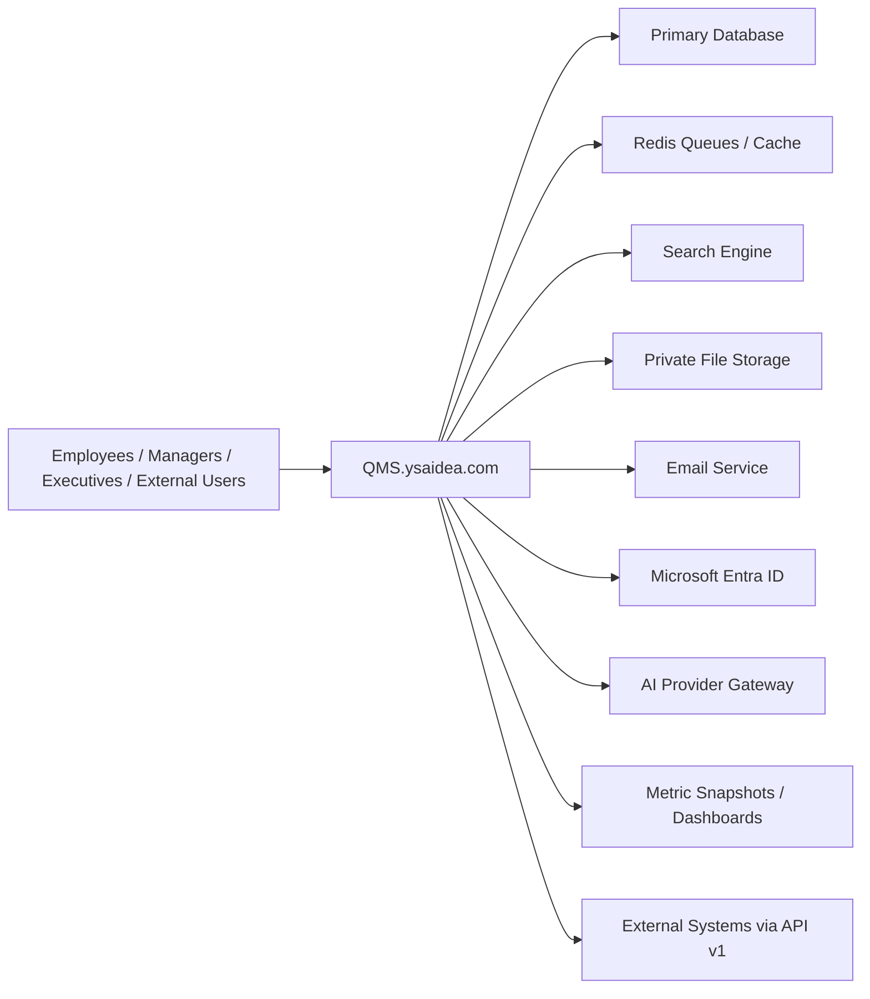
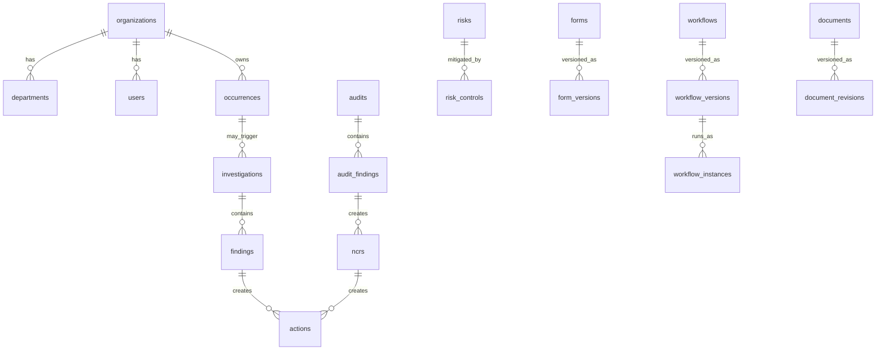
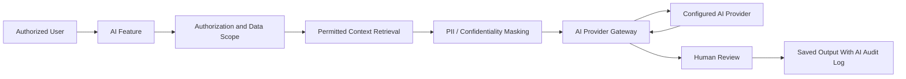

# QMS.ysaidea.com BRSD and Architecture Blueprint

Prepared for: QMS enterprise platform  
Target URL: https://QMS.ysaidea.com  
Date: 2026-08-17  
Status: Research-first blueprint, no production modifications performed

---

## Research and Architecture Findings

### Sources And Products Reviewed

This blueprint is based on a research pass across aviation SMS guidance, ISO management-system concepts, modern QMS/EHS product patterns, and the current Laravel ecosystem.

Primary public sources reviewed:

- ICAO Safety Management guidance: Annex 19 access guidance, Safety Management Manual references, Safety Intelligence Manual references, and safety-management SARPs update notes.
- FAA SMS guidance: SMS definition, four SMS components, airport SMS guidance, and AC 120-92D.
- ISO public guidance: ISO 9000/9001 family, ISO quality management principles, ISO 14000/14001 family, ISO 31000 risk management.
- Laravel official documentation: Laravel 12 release/support policy, installation, testing, database, Scout, Broadcasting/Reverb, Sanctum, Horizon.
- Package ecosystem references: Livewire 4 docs/GitHub, Tailwind CSS v4.3 blog, Spatie Laravel Permission, Laravel Excel/Packagist.
- Market/product references: Ideagen Q-Pulse / Ideagen Quality Management / Ideagen Aviation Safety / EHS buyer-pattern references.

Important source links:

- ICAO Safety Management guidance: https://www.icao.int/safety-management/guidance-material
- ICAO Annexes and guidance access: https://www.icao.int/safety-management/access-icao-annexes-and-guidance
- ICAO SARPs summary: https://www.icao.int/safety-management/standards-and-recommended-practices-sarps
- FAA SMS overview: https://www.faa.gov/about/initiatives/sms
- FAA SMS components: https://www.faa.gov/about/initiatives/sms/explained/components
- FAA airport SMS: https://www.faa.gov/airports/airport_safety/safety_management_systems
- FAA AC 120-92D: https://www.faa.gov/regulations_policies/advisory_circulars/index.cfm/go/document.information/documentID/1042733
- ISO quality management principles: https://www.iso.org/quality-management/principles
- ISO 9000 family: https://www.iso.org/standards/popular/iso-9000-family
- ISO 14000 family: https://www.iso.org/standards/popular/iso-14000-family
- ISO 31000:2018: https://www.iso.org/standard/65694.html
- Laravel 12 releases: https://laravel.com/docs/12.x/releases
- Laravel 12 installation: https://laravel.com/docs/12.x/installation
- Laravel Scout: https://laravel.com/docs/12.x/scout
- Laravel Broadcasting/Reverb: https://laravel.com/docs/12.x/broadcasting
- Laravel Sanctum: https://laravel.com/docs/11.x/sanctum
- Tailwind CSS v4.3: https://tailwindcss.com/blog/tailwindcss-v4-3
- Livewire 4 installation: https://livewire.laravel.com/docs/4.x/installation
- Spatie Laravel Permission: https://github.com/spatie/laravel-permission
- Laravel Excel Packagist: https://packagist.org/packages/maatwebsite/excel
- Ideagen Q-Pulse: https://www.ideagen.com/products/q-pulse
- Ideagen Quality Management: https://www.ideagen.com/solutions/quality/quality-management

### Current Technology Findings

- Laravel latest documented stable target for this blueprint: Laravel 12.x. Laravel's release table shows Laravel 12 requires PHP 8.2 to 8.5, with bug fixes until 2026-08-13 and security fixes until 2027-02-24. Laravel 13 is shown as a future/Q1 2026 line in the official support policy, but the safe production baseline today is Laravel 12 unless the actual implementation date confirms Laravel 13 is stable and compatible with required packages.
- PHP target: PHP 8.4 is recommended for initial build unless the deployment server already supports PHP 8.5 safely. PHP 8.4 gives modern runtime support without forcing the newest PHP edge.
- Frontend: Tailwind CSS v4.x, Vite, Alpine.js, and Livewire 4 are viable for a Laravel-first enterprise app. For complex graphical builders, use dedicated client-side components where Livewire alone would become awkward.
- Realtime: Laravel Reverb is the first-party WebSocket direction for Laravel broadcasting. Use it for assignment updates, workflow timeline changes, notifications, and collaborative review indicators, not for aggressive dashboard polling.
- Search: Laravel Scout with database engine for phase 1 if the dataset is small; Meilisearch or Typesense for production-grade faceted global search, typo tolerance, saved filters, and high-volume indexing.
- Queues: Redis queues plus Laravel Horizon should be considered mandatory for exports, notifications, AI processing, document conversion, search indexing, imports, and report generation.
- Permissions: Spatie Laravel Permission is strong for role/permission primitives, but QMS needs an additional policy layer for record, field, workflow-stage, organization, department, location, confidentiality, and legal-retention constraints.
- Exports/imports: Laravel Excel is compatible with Laravel 12/13 per Packagist and supports queued imports/exports. Large exports must be queued.

### Common Weaknesses Discovered In Legacy QMS/EHS/SMS Platforms

- Too many disconnected modules: incident, audit, CAPA, document control, and risk often behave as separate systems.
- Excessive clicking: users navigate deep menu trees to submit simple reports or close actions.
- Weak search: records are found by exact number only, not full-context search across evidence, attachments, findings, actions, and documents.
- Reporting fatigue: users are forced to complete large static forms even when only a few fields apply.
- Workflow opacity: users cannot easily see who owns the next step or why a record is stuck.
- Notification overload: all events produce emails instead of digesting, priority filtering, or role-based routing.
- Weak investigation tooling: 5 Whys, fishbone, bow-tie, barrier analysis, and SHELL are often static forms instead of guided visual analysis.
- Permission fragility: simple role permissions do not handle confidential reports, anonymous reports, external parties, departments, locations, or workflow-stage restrictions.
- Slow dashboards: operational screens frequently query transactional tables directly without caching, pre-aggregation, or materialized metrics.
- Poor mobile reporting: field users need fast camera/audio/attachment capture, offline draft support, and short guided forms.
- Limited AI governance: newer platforms advertise AI, but serious regulated systems need masking, authorization, audit logs, human approval, and provider control.

### Aviation SMS Requirements Identified

The platform should model ICAO/FAA SMS around four core components:

- Safety Policy and Objectives
- Safety Risk Management
- Safety Assurance
- Safety Promotion

Important design implications:

- Occurrence reporting must support mandatory, voluntary, confidential, and anonymous reporting.
- Safety data protection and Just Culture principles must be reflected in access control, case handling, language, and reporting.
- Safety-risk assessment must link hazards, events, controls, initial risk, residual risk, accepted risk, and review cycles.
- Safety assurance requires audits, inspections, monitoring, SPIs, safety actions, trend analysis, and effectiveness checks.
- Safety promotion requires training, communications, lessons learned, safety bulletins, and awareness tracking.
- The system should support configurable frameworks rather than hard-code a single regulator.

### ISO / Enterprise Management Findings

The system should support management-system standards through configurable frameworks, clauses, obligations, evidence, controls, audits, objectives, actions, and reviews. It should not pretend to certify an organization automatically.

Core concepts to support:

- Context of organization
- Interested parties
- Leadership and accountability
- Planning, objectives, and risk-based thinking
- Support, competence, awareness, communication
- Operational control
- Performance evaluation
- Internal audit
- Management review
- Improvement
- Nonconformity and corrective action
- Documented information
- Compliance obligations

### Requirements That Should Be Changed Or Clarified

- Do not build everything as one first release. The requested product scope is valid as a long-term platform, but implementation must be phased.
- Do not rely only on Spatie permissions. It is useful, but QMS requires a domain permission engine above it.
- Do not use one universal polymorphic "everything links to everything" structure. Use explicit relationships for core regulated records, plus a controlled relationship table for cross-module links.
- Do not make AI a chatbot-first feature. AI should appear inside workflows with explicit permission checks and human approval.
- Do not replace Miniworld directly. QMS must be deployed separately, verified, backed up, and switched only after rollback is tested.
- Do not assume the final Laravel version until implementation begins. Re-check Laravel, PHP, Livewire, Tailwind, and package compatibility immediately before coding.

### Requirements That Should Be Added

- Management Review module
- Safety Committees and Meeting Management
- SPI/KPI Objectives module
- Management of Change
- Training and Competency
- Supplier/Contractor Quality and HSE
- Compliance Obligations / Regulatory Register
- Lessons Learned / Safety Promotion
- Public or semi-public reporting portal
- Offline-capable mobile reporting as a future phase
- Data retention and legal hold
- Data classification and confidentiality labels
- Evidence repository with chain-of-custody metadata
- API integration event log
- AI red-team test suite

---

## BRSD

### 1. Executive Summary

QMS.ysaidea.com will be an enterprise-grade Laravel platform combining quality management, aviation safety management, HSE, risk, audit, compliance, investigation, CAPA, NCR, document control, workflow automation, BI, and governed AI.

The product should become a modern replacement for Miniworld only after a separate deployment, verified backups, controlled migration, user acceptance testing, and rollback validation. The first goal is not code generation. The first goal is a durable architecture that can support regulated workflows, Arabic/English localization, high-performance reporting, granular permissions, and long-term modular growth.

### 2. Background

Traditional QMS/SMS tools often digitize paper processes without improving them. QMS.ysaidea.com should instead be workflow-native, mobile-aware, searchable, configurable, and built around linked operational evidence.

### 3. Existing Problem

Known problems to solve:

- fragmented records across quality, safety, audit, risk, and CAPA
- slow or incomplete management visibility
- static forms that do not adapt to event type
- difficult workflow changes
- weak mobile reporting
- unclear ownership of overdue actions
- manual audit evidence collection
- poor linkage between findings, risk, action, and closure
- limited Arabic/RTL readiness
- insufficient permission depth for confidential safety data

Miniworld-specific findings cannot be completed from the current workspace because no Miniworld files, server access, database credentials, `.env`, web-server config, or deployment path are available here.

### 4. Product Vision

QMS.ysaidea.com should be the operational nervous system for safety, quality, audit, compliance, HSE, and improvement. A user should be able to report an issue quickly, route it intelligently, investigate it rigorously, assign effective actions, verify closure, learn from trends, and prove compliance with defensible records.

### 5. Business Objectives

- Reduce reporting friction.
- Improve safety and quality visibility.
- Centralize CAPA and action ownership.
- Maintain audit-ready evidence.
- Support configurable compliance frameworks.
- Reduce manual administration through form, workflow, notification, and report designers.
- Enable executive BI without overloading production tables.
- Use AI responsibly to improve quality of decisions, not replace accountable humans.

### 6. Stakeholders

- Executive leadership
- Safety department
- Quality department
- HSE department
- Audit team
- Risk and compliance team
- Department managers
- Investigators
- Action owners
- Auditees
- Service providers and contractors
- IT administrators
- Regulators and external auditors
- General staff/reporters

### 7. Personas

- Reporter: needs quick, low-friction reporting from desktop or mobile.
- Screener: classifies reports, rejects invalid reports, routes valid reports, protects confidentiality.
- Investigator: gathers evidence, interviews, analyzes causes, drafts findings and recommendations.
- Action Owner: receives clear tasks, due dates, evidence requirements, and completion workflow.
- Auditor: plans audits, executes checklists, records evidence, raises findings.
- Manager: monitors open risk, overdue actions, and department performance.
- Executive: needs reliable trends, SPIs, KPIs, heat maps, and assurance summaries.
- Super Admin: configures modules, forms, workflows, permissions, branding, dashboards, integrations, and licensing.
- External User: sees only explicitly assigned supplier/contractor/auditee records.

### 8. Scope

Included long-term scope:

- Core platform
- Identity and access
- Organization structure
- Modular licensing
- Form designer
- Workflow designer
- Notification designer
- Occurrence and incident reporting
- Investigation management
- CAPA and action management
- NCR
- Audit management and audit designer
- Risk management
- Document control
- Compliance obligations
- BI dashboards
- Report designer
- AI assistance and governance
- Microsoft Entra ID integration
- API v1
- English/Arabic localization
- Deployment and migration strategy

### 9. Out Of Scope For Phase 1

- Native mobile apps
- Offline sync beyond saved browser drafts
- Full SaaS multi-tenant billing
- Microservices
- WhatsApp/SMS delivery
- Direct flight-data monitoring ingestion
- Full regulatory e-filing
- Predictive ML models trained on customer data

### 10. Business Requirements

| ID | Module | Description | Rationale | Priority | Dependencies | Acceptance Criteria |
|---|---|---|---|---|---|---|
| BR-001 | Core | Provide one integrated platform for QMS, SMS, HSE, risk, audit, compliance, investigations, CAPA, documents, BI, and AI. | Reduces fragmented work and duplicate evidence. | Critical | Core domains | Users can navigate linked records across modules. |
| BR-002 | Licensing | Support module-based licensing without deleting customer data after expiry. | Enables commercial flexibility and safe retention. | High | Module registry | Expired modules become read-only or hidden by policy while data remains intact. |
| BR-003 | Administration | Super Admin can configure business behavior without code changes. | Reduces dependency on developers. | Critical | Admin center | Forms, workflows, roles, dashboards, and categories are configurable from UI. |
| BR-004 | UX | Common workflows must require minimal screens and clicks. | Improves adoption and data quality. | Critical | UI architecture | Simple occurrence submission completes in one guided flow. |
| BR-005 | Compliance | Support multiple configurable frameworks. | Avoids hard-coded regulator dependence. | Critical | Compliance module | Admin can map clauses/requirements to evidence, audits, risks, and actions. |
| BR-006 | Evidence | Maintain defensible audit trails and record histories. | Required for regulated decisions. | Critical | Audit log | Critical changes show actor, timestamp, old value, new value, and reason where required. |
| BR-007 | Localization | Support English, Arabic, and RTL from day one. | Required for regional usability. | High | i18n | User can switch locale and UI mirrors correctly in Arabic. |

### 11. Functional Requirements

| ID | Module | Description | Rationale | Priority | Dependencies | Acceptance Criteria |
|---|---|---|---|---|---|---|
| FR-001 | Forms | Provide versioned form designer with conditional logic. | Supports evolving reporting without losing historical meaning. | Critical | Form engine | Historical submissions render using original form version. |
| FR-002 | Workflows | Provide versioned workflow designer with branches, parallel tasks, SLA, escalation, assignment, approval, return, reopen, and closure. | Supports regulated processes. | Critical | Workflow engine | Workflow changes affect new instances only unless migrated deliberately. |
| FR-003 | Notifications | Provide configurable notification rules and distribution groups. | Reduces manual follow-up and notification noise. | High | Workflow/events | Admin can define event-based in-app and email rules. |
| FR-004 | Occurrence | Support mandatory, voluntary, confidential, and anonymous reporting. | Required for SMS and Just Culture. | Critical | Forms/permissions | Confidential and anonymous records hide reporter identity according to policy. |
| FR-005 | Investigation | Support team, lead investigator, scope, evidence, interviews, timeline, analysis, findings, recommendations, approvals, report, and closure. | Enables rigorous investigations. | Critical | Workflow/actions/reports | Investigation cannot close until required findings/actions are resolved or justified. |
| FR-006 | Analysis | Provide interactive 5 Whys, fishbone, SHELL, bow-tie, barrier analysis, event sequence, cause mapping, and fault tree tools where practical. | Improves root-cause quality. | High | UI components | Users can create visual analyses linked to investigation findings. |
| FR-007 | CAPA | Provide centralized action management across all modules. | Prevents action silos. | Critical | Workflow/permissions | Actions show source record, owner, due date, status, evidence, verification, and effectiveness. |
| FR-008 | NCR | Support source, standard, clause, severity, evidence, correction, root cause, corrective/preventive action, verification, effectiveness, approval, closure, and reopening. | Supports ISO-style improvement. | High | CAPA/compliance | NCR can generate CAPA and link to audit/compliance records. |
| FR-009 | Audit | Support annual programme, audit plan, schedule, team, scope, criteria, checklists, evidence, findings, NCRs, CAPA, follow-up, and closure. | Enables audit readiness. | High | Audit designer/CAPA | Audit findings can create NCR/CAPA with traceability. |
| FR-010 | Risk | Support configurable risk matrices, hazard/risk registers, controls, initial/residual risk, owners, reviews, acceptance criteria. | Enables SMS/ERM/HSE risk management. | Critical | Admin config | Admin can create 3x3, 4x4, 5x5, and custom matrices. |
| FR-011 | BI | Provide dashboards by role and module. | Supports evidence-led decisions. | High | Metrics layer | Executive dashboard loads from pre-aggregated metrics. |
| FR-012 | Search | Provide authorized global search across records and documents. | Reduces wasted time. | Critical | Search index/permissions | Search results only include records the user is authorized to view. |
| FR-013 | Exports | Support Excel, PDF, Word, CSV exports. | Required for audits and reporting. | High | Queues/reports | Large exports run in background and notify user when ready. |
| FR-014 | Documents | Provide controlled-document lifecycle and acknowledgement. | Required for documented information. | High | Workflow/files | Published documents have versions, effective dates, review dates, and read confirmations. |
| FR-015 | External Access | Support restricted external service-provider access. | Enables supplier/contractor workflows. | Medium | Permissions | External users see only explicitly assigned records. |

### 12. Non-Functional Requirements

| ID | Module | Description | Priority | Acceptance Criteria |
|---|---|---|---|---|
| NFR-001 | Performance | Main list pages should load quickly under realistic data volumes. | Critical | Server-side pagination, indexed filters, no N+1 queries. |
| NFR-002 | Scalability | Background jobs handle exports, notifications, AI, imports, indexing, and document rendering. | Critical | Redis queues and Horizon are deployed. |
| NFR-003 | Maintainability | Use domain-oriented Laravel structure with thin controllers. | High | Business logic lives in actions/services/jobs/policies. |
| NFR-004 | Availability | Production deployment uses release-based strategy and rollback. | High | `/current` symlink can roll back to previous release. |
| NFR-005 | Accessibility | Follow practical WCAG principles. | High | Keyboard navigation, focus states, labels, contrast, accessible errors. |
| NFR-006 | Localization | English/Arabic text must use translation files. | High | No hard-coded UI strings in major screens. |

### 13. Regulatory Requirements

| ID | Module | Description | Priority | Acceptance Criteria |
|---|---|---|---|---|
| REG-001 | Compliance | Frameworks must be configurable by standard/regulator/clause. | Critical | Admin can create frameworks and map records as evidence. |
| REG-002 | SMS | Support ICAO/FAA SMS pillars as configurable framework mapping. | Critical | Reports, risks, assurances, promotions, and policy records can be mapped. |
| REG-003 | ISO | Support ISO-style management clauses, objectives, documented information, audit, review, and improvement. | High | ISO framework templates can be configured without code. |
| REG-004 | Retention | Safety/quality records must not be casually deleted. | Critical | Archive/cancel/supersede flows preserve history. |

### 14. Safety Requirements

| ID | Description | Priority | Acceptance Criteria |
|---|---|---|---|
| SMS-001 | Provide hazard identification and occurrence reporting. | Critical | Hazard and occurrence records link to risks and controls. |
| SMS-002 | Support safety risk management workflow. | Critical | Initial risk, controls, residual risk, acceptance, and review are captured. |
| SMS-003 | Support safety assurance through audits, SPIs, trend analysis, corrective action, and effectiveness review. | Critical | Dashboards show SPI targets and deviations. |
| SMS-004 | Support safety promotion through lessons learned, bulletins, training links, and read confirmations. | High | Lessons can be distributed and acknowledged. |
| SMS-005 | Protect confidential and anonymous reporting. | Critical | Reporter identity fields are masked according to policy. |

### 15. Quality Requirements

| ID | Description | Priority | Acceptance Criteria |
|---|---|---|---|
| QMS-001 | Support NCR lifecycle. | High | NCRs proceed from identification to closure/effectiveness. |
| QMS-002 | Support CAPA lifecycle. | Critical | Corrective actions include owner, due date, evidence, verification, and effectiveness. |
| QMS-003 | Support document control. | High | Users can identify the current effective version. |
| QMS-004 | Support objectives and management reviews. | High | Objectives show owner, measure, target, period, status, and review actions. |

### 16. Security Requirements

| ID | Module | Description | Priority | Acceptance Criteria |
|---|---|---|---|---|
| SEC-001 | Access | Enforce least privilege by module, record, organization, department, location, workflow stage, field, and confidentiality. | Critical | Unauthorized direct URL access returns 403. |
| SEC-002 | Auth | Support local login, Microsoft Entra SSO, MFA compatibility, session security, and fallback accounts. | Critical | Entra users can authenticate and mapped groups sync. |
| SEC-003 | Uploads | Validate file type, size, malware scanning where available, storage privacy, signed links, and audit logs. | Critical | Private files are never directly web-public. |
| SEC-004 | API | API v1 uses token scopes/rate limits and policy checks. | High | API cannot bypass UI permissions. |
| SEC-005 | Logs | Maintain security logs for auth, admin, permission, export, and AI events. | High | Admin can review security-sensitive activity. |

### 17. UX Requirements

| ID | Description | Priority | Acceptance Criteria |
|---|---|---|---|
| UX-001 | Provide role-aware dashboard as first screen. | Critical | Users see work relevant to their role. |
| UX-002 | Provide global search and command palette. | High | Keyboard users can open search/actions quickly. |
| UX-003 | Provide record workspace with summary, status, timeline, linked records, actions, evidence, comments, and audit trail. | Critical | Record state is understandable without opening many tabs. |
| UX-004 | Avoid large static forms by using progressive disclosure and conditional sections. | Critical | Flight fields appear only when occurrence type requires them. |
| UX-005 | Mobile reporting must support fast capture and attachments. | High | Reporters can submit a simple report from mobile in a few steps. |

### 18. Performance Requirements

| ID | Description | Priority | Acceptance Criteria |
|---|---|---|---|
| PERF-001 | All table lists use server-side pagination and indexed filters. | Critical | No unbounded list loads. |
| PERF-002 | Dashboards use cached/pre-aggregated metrics. | Critical | Operational dashboards do not run heavy scans on page load. |
| PERF-003 | Background jobs handle large exports/imports. | Critical | Exports above threshold queue automatically. |
| PERF-004 | Search indexing is asynchronous. | High | Record updates do not block user workflow on search indexing. |

### 19. Availability Requirements

- Release-based deployment.
- Database backups before migrations.
- Queue workers managed by supervisor/systemd.
- Scheduler configured exactly once.
- Health checks for app, database, Redis, queues, storage, search, and mail.
- Rollback process documented and tested.

### 20. Data Requirements

- Multi-organization-ready schema.
- Explicit ownership and access scope on regulated records.
- Immutable audit logs for critical changes.
- Versioned forms, workflows, checklists, risk matrices, and documents.
- Controlled attachments and evidence metadata.
- Retention policies by module, record type, classification, and legal hold.

### 21. AI Requirements

| ID | Module | Description | Priority | Acceptance Criteria |
|---|---|---|---|---|
| AI-001 | Governance | AI must only access records authorized for the current user. | Critical | Tests prove unauthorized records are excluded from AI context. |
| AI-002 | Reporting | AI can improve grammar, summarize, detect missing info, suggest classification, and detect duplicates. | High | Suggestions are labeled AI-assisted and require human acceptance. |
| AI-003 | Investigation | AI can suggest questions, summarize evidence, assist cause analysis, and draft findings. | High | Investigator approval is required before use in official report. |
| AI-004 | CAPA | AI can flag vague actions and suggest measurable corrections. | High | Action owner/reviewer chooses final wording. |
| AI-005 | Audit | AI can generate checklist suggestions, map clauses, summarize evidence, and draft findings. | Medium | Auditor approves final checklist/finding. |
| AI-006 | BI | AI can answer natural-language questions over authorized metrics. | Medium | Answers cite underlying records/aggregations where possible. |
| AI-007 | Controls | Support masking, prompt security, audit logs, provider abstraction, usage limits, and licensing. | Critical | Admin can review AI usage by user/module/provider. |

### 22. Integration Requirements

| ID | Description | Priority | Acceptance Criteria |
|---|---|---|---|
| INT-001 | Microsoft Entra SSO and group sync. | High | Entra groups map to QMS groups/roles. |
| INT-002 | Email delivery. | Critical | Notifications send via configured mail transport. |
| INT-003 | Microsoft Teams future channel. | Medium | Notification engine has channel abstraction. |
| INT-004 | API v1. | High | External systems can create/query authorized records. |
| INT-005 | Future HR/ERP/flight systems. | Medium | Integration events and API logs are stored. |

### 23. Licensing Requirements

- Module activation/deactivation.
- User limits.
- Organization/site limits.
- Storage limits.
- AI consumption limits.
- API access limits.
- Feature flags.
- Grace period and read-only behavior.
- No customer data deletion on license expiration.

### 24. Reporting Requirements

- Operational list reports.
- Dashboard charts.
- Professional PDF/Word report designer.
- Excel/CSV exports.
- Scheduled reports.
- Role-based report templates.
- Queue-based generation.
- Export permissions.
- Report audit logs.

### 25. Notification Requirements

- In-app notifications.
- Email notifications.
- Future Teams/SMS/WhatsApp channels.
- Rule designer by event/status/assignment/department/group/priority/due date.
- Digest mode.
- Quiet hours.
- Escalation mode.
- Notification audit log.

### 26. Workflow Requirements

- Versioned workflows.
- Human and automated tasks.
- Branching and conditions.
- Parallel and sequential paths.
- SLA and escalation.
- Return/reject/reopen.
- Assignment rules.
- Approval chains.
- Stage-level permissions.
- Visual workflow tracker on every record.

### 27. Audit Trail Requirements

Critical actions must record:

- actor
- timestamp
- action
- source IP/user agent where appropriate
- old value
- new value
- reason where legally/operationally required
- related record
- workflow transition
- export/download where sensitive

### 28. Retention Requirements

- Retention rules per module.
- Legal hold.
- Archive instead of delete.
- Supersede/correction mechanisms.
- Document version retention.
- Attachment retention.
- Export retention and expiry.

### 29. Module Requirements

Recommended module set:

- Core
- Identity
- Administration
- Licensing
- Organizations
- Forms
- Workflows
- Notifications
- Occurrence/Incident
- SMS
- Investigation
- CAPA/Actions
- NCR
- Audit
- Risk
- HSE
- Document Control
- Compliance Obligations
- Management Review
- Objectives/SPI/KPI
- Safety Committees/Meetings
- Supplier/Contractor
- Training and Competency
- BI
- AI
- Integrations
- API

### 30. Permission Model

Permission engine layers:

1. Authentication: local, SSO, MFA.
2. Role/group permissions: coarse capability checks.
3. Module license checks: module available to organization/user.
4. Organization scope: tenant/org/site restrictions.
5. Department/location scope.
6. Record ownership/assignment.
7. Workflow-stage permissions.
8. Field-level visibility/editability.
9. Confidentiality/anonymity policy.
10. Export/download permissions.
11. AI-context permissions.

Example permission atoms:

- `occurrence.view`
- `occurrence.submit`
- `occurrence.screen`
- `occurrence.view_confidential_identity`
- `investigation.lead`
- `capa.assign`
- `capa.verify`
- `audit.plan`
- `audit.execute`
- `ncr.approve`
- `risk.accept`
- `document.publish`
- `admin.configure_forms`
- `admin.configure_workflows`
- `report.export`
- `ai.use_investigation_assistant`

### 31. Architecture

QMS should use a modular monolith first. This is the best practical architecture for the requested scope because it keeps transactions, permissions, workflows, and reporting coherent while avoiding the operational overhead of premature microservices.

Recommended domain boundaries:

- `Core`
- `Identity`
- `Admin`
- `Licensing`
- `Organizations`
- `Forms`
- `Workflows`
- `Notifications`
- `Occurrences`
- `Investigations`
- `Actions`
- `Audit`
- `Risk`
- `Documents`
- `Compliance`
- `BI`
- `AI`
- `Integrations`

Controller rule: controllers receive requests, authorize, delegate to actions/services, and return responses. They should not contain business workflow logic.

### 32. Database Architecture

Principles:

- Use explicit tables for core regulated records.
- Use JSON for form schema/version snapshots and flexible submission answers, but extract frequently filtered fields into indexed columns or materialized field-value tables.
- Use a controlled relationship table for cross-record links.
- Use versioned definitions for forms, workflows, risk matrices, checklists, and documents.
- Use UUID/ULID public identifiers where possible.
- Design for future multi-organization support using `organization_id` and scoped unique constraints.

Core table groups:

- Identity: `users`, `auth_providers`, `user_identities`, `groups`, `roles`, `permissions`, `role_permission`, `group_user`, `role_user`, `access_scopes`
- Organization: `organizations`, `departments`, `sections`, `locations`, `stations`, `teams`
- Licensing: `modules`, `licenses`, `license_entitlements`, `feature_flags`
- Forms: `forms`, `form_versions`, `form_fields`, `form_submissions`, `form_submission_values`
- Workflows: `workflows`, `workflow_versions`, `workflow_nodes`, `workflow_transitions`, `workflow_instances`, `workflow_tasks`, `workflow_events`
- Records: `occurrences`, `incidents`, `investigations`, `findings`, `root_causes`, `actions`, `capas`, `ncrs`, `risks`, `risk_controls`, `audits`, `audit_findings`
- Documents: `documents`, `document_revisions`, `document_reviews`, `document_acknowledgements`
- Compliance: `frameworks`, `requirements`, `obligations`, `evidence_links`
- BI: `metric_definitions`, `metric_snapshots`, `dashboard_definitions`, `saved_views`
- AI: `ai_providers`, `ai_interactions`, `ai_context_items`, `ai_usage`
- Support: `attachments`, `comments`, `approvals`, `record_links`, `audit_logs`, `notifications`, `exports`

### 33. API Architecture

- Version prefix: `/api/v1/`
- Use Laravel Sanctum for first-party SPA/API tokens where appropriate.
- Use scoped tokens for integrations.
- Apply policies to every endpoint.
- Use rate limiting and audit logs.
- Use event log for inbound/outbound integrations.
- API resources should avoid leaking unauthorized relationships.

### 34. UI Architecture

Recommended stack:

- Laravel Blade/Livewire for server-led enterprise UI.
- Alpine.js for lightweight interactions.
- Tailwind CSS v4 for design system.
- Dedicated JavaScript components for visual builders, diagrams, command palette, and advanced chart interactions.
- Reverb for realtime notifications and collaborative status updates.

Visual language:

- restrained enterprise interface
- dense but calm information layout
- clear workflow states
- high-contrast status colors
- keyboard-friendly navigation
- responsive split panes
- Arabic RTL-ready layout tokens

### 35. Deployment Architecture

Preferred production structure:

```text
/var/www/qms/releases/20260817-001
/var/www/qms/releases/20260817-002
/var/www/qms/current -> /var/www/qms/releases/20260817-002
/var/www/qms/shared/.env
/var/www/qms/shared/storage
```

Deployment steps:

1. Upload release to new release folder.
2. Install Composer dependencies.
3. Build frontend assets.
4. Link shared `.env` and storage.
5. Run config validation.
6. Run migrations after backup.
7. Warm caches.
8. Run smoke tests.
9. Switch `current` symlink.
10. Restart PHP-FPM/queues/Reverb as needed.
11. Monitor logs and health checks.

### 36. Miniworld Migration Strategy

Current status: Miniworld was not available in this workspace. Required discovery before migration:

- application path
- Laravel/framework version
- PHP/composer/node versions
- OS/web server
- database engine/version
- `.env`
- storage/uploads
- users/auth
- modules and workflows
- scheduled tasks
- queues/Redis
- SSL/DNS
- deployment permissions

Migration approach:

1. Read-only discovery.
2. Verified backups.
3. Data mapping.
4. QMS deployed separately.
5. Import rehearsal on staging.
6. UAT.
7. Parallel run if practical.
8. DNS/vhost switch.
9. Rollback window.
10. Post-migration verification.

### 37. Backup Strategy

Before production modification, back up:

- app files
- database dump
- `.env`
- uploaded files
- storage directory
- cron configuration
- web-server configuration
- SSL configuration
- queue/supervisor configuration
- deployment scripts

Backups must be verified by restore test, not only file creation.

### 38. Disaster Recovery

- Maintain last known good release.
- Maintain database backup before migrations.
- Store backups off-server where possible.
- Document restore commands.
- Define RPO/RTO.
- Test rollback on staging.

### 39. Testing Strategy

Test categories:

- Unit tests for domain services and actions.
- Feature tests for workflows.
- Authorization tests for every module.
- Direct-ID access tests.
- Confidential/anonymous reporting tests.
- Form version rendering tests.
- Workflow version tests.
- Audit/CAPA/NCR lifecycle tests.
- Export queue tests.
- AI permission/masking tests.
- API scope tests.
- File upload security tests.
- Localization/RTL smoke tests.
- Browser tests for critical user journeys.

### 40. Risks

- Scope too large for one release.
- Permissions complexity underestimated.
- AI privacy risk if context retrieval is poorly designed.
- Dashboard performance risk if metrics are queried live from transactional tables.
- Migration risk without Miniworld discovery.
- User adoption risk if forms remain too long.
- Regulatory risk if the system implies certification rather than evidence support.

### 41. Assumptions

- Initial deployment is single organization but future multi-organization is required.
- Laravel remains the preferred platform.
- QMS initially replaces Miniworld only after separate verification.
- Users need English and Arabic.
- The production server can support PHP 8.4+, Redis, queues, and a search service or can be upgraded.

### 42. Dependencies

- Server access
- Miniworld source/database access
- DNS/SSL control for `QMS.ysaidea.com`
- Mail provider
- Microsoft Entra tenant details
- AI provider decision
- Redis availability
- Search engine decision
- Regulatory framework templates
- Business process owners for each module

### 43. Acceptance Criteria

QMS phase 1 is acceptable when:

- users can log in locally and, if configured, through Entra
- roles/groups/permissions restrict access correctly
- reporter can submit an occurrence quickly
- screener can classify and route
- investigator can manage investigation
- action owner can complete CAPA/action
- manager can see dashboard and overdue items
- admin can configure forms/workflows/categories/risk matrix
- audit logs capture critical changes
- exports work through queues
- search respects permissions
- Arabic/RTL foundation works
- backups and rollback are tested

### 44. Implementation Roadmap

Phase 0: Discovery and Server Inspection

- Inspect Miniworld and production server.
- Document versions, database, storage, queues, cron, web server, SSL, DNS.
- Create backup and rollback procedure.

Phase 1: Foundation

- Laravel 12 app.
- Authentication.
- Organizations/departments/locations.
- Role/group/permission foundation.
- Module registry/licensing foundation.
- Audit log.
- Localization.
- Design system.

Phase 2: Forms, Workflows, Notifications

- Form designer MVP.
- Workflow designer MVP.
- Notification rules.
- Record workspace.
- Global search foundation.

Phase 3: Occurrence, Investigation, CAPA

- Occurrence reporting.
- Screening workflow.
- Investigation workspace.
- CAPA/action management.
- Evidence and attachments.
- Basic reports.

Phase 4: Audit, NCR, Risk

- Audit programme/planning/checklists.
- Findings/NCR.
- Risk register/matrices/controls.
- Linked records.

Phase 5: Documents, Compliance, BI

- Document control.
- Compliance frameworks.
- BI dashboards.
- Metric snapshots.
- Scheduled reports.

Phase 6: AI and Integrations

- AI provider abstraction.
- AI assistance in reporting/investigation/CAPA/audit/BI.
- AI audit logs and masking.
- Entra group sync.
- API v1 hardening.

Phase 7: Migration and Production Switch

- Staging migration.
- UAT.
- Production backup.
- Separate QMS deployment.
- Cutover.
- Rollback readiness.

### 45. Definition Of Done

- Requirements implemented and tested.
- Authorization tested for allowed and denied paths.
- User journeys verified on desktop/tablet/mobile.
- Arabic/RTL checked for main screens.
- Performance checked for representative data.
- Queues, scheduler, mail, storage, search, and logs verified.
- Audit logs verified.
- Documentation updated.
- Backups and rollback validated.
- No production switch without signoff.

---

## Architecture Deliverables

### Complete Module Map

```text
Core
Identity
Administration
Licensing
Organizations
Forms
Workflows
Notifications
Occurrences / Incident Management
SMS
Investigation
CAPA / Actions
NCR
Audit
Risk
HSE
Documents
Compliance
Management Review
Objectives / SPI / KPI
Training / Competency
Supplier / Contractor
BI
AI
Integrations
API
```

### System Context



### Laravel Architecture

```text
app/
  Domains/
    Occurrences/
      Actions/
      Models/
      Policies/
      Services/
      Data/
      Events/
      Jobs/
    Investigations/
    Actions/
    Audit/
    Risk/
    Documents/
    Workflows/
    Forms/
    AI/
  Http/
    Controllers/
    Requests/
    Resources/
  Livewire/
  Policies/
  Providers/
```

### Database Architecture Summary

Use explicit core tables with versioned configuration tables and a controlled `record_links` table for cross-module relationships.



### Role / Permission Matrix

Roles are configurable. The following is a starter matrix only.

| Capability | Super Admin | Admin | Safety Admin | Quality Admin | Investigator | Auditor | Manager | Reporter | External |
|---|---|---|---|---|---|---|---|---|---|
| Configure platform | Yes | Partial | No | No | No | No | No | No | No |
| Submit report | Yes | Yes | Yes | Yes | Yes | Yes | Yes | Yes | Limited |
| Screen safety report | Yes | Optional | Yes | No | Optional | No | No | No | No |
| Lead investigation | Yes | Optional | Optional | Optional | Yes | No | No | No | No |
| Assign CAPA | Yes | Yes | Yes | Yes | Optional | Optional | Optional | No | No |
| Complete assigned action | Yes | Yes | Yes | Yes | Yes | Yes | Yes | Yes | Assigned only |
| Plan audit | Yes | Optional | No | Yes | No | Yes | No | No | No |
| View executive BI | Yes | Optional | Optional | Optional | No | Optional | Yes | No | No |
| Export records | Yes | Configurable | Configurable | Configurable | Configurable | Configurable | Configurable | No | No |

### Workflow Model

Core state machine concepts:

- draft
- submitted
- screening
- returned
- rejected
- accepted
- classified
- assigned
- risk_assessed
- investigation_required
- investigation_open
- findings_review
- actions_open
- approval
- effectiveness_review
- closed
- reopened
- archived

### Form Engine Architecture

- `forms`: logical form.
- `form_versions`: immutable schema snapshot.
- `form_fields`: normalized metadata for searchable/configurable fields.
- `form_submissions`: submitted record, linked to version.
- `form_submission_values`: structured values for filtering/reporting.
- JSON schema stores layout, conditional logic, validation, options, and translations.
- Field rules support required, visible, editable, calculated, hidden, and workflow-stage-specific behavior.

### Workflow Engine Architecture

- Workflow definition is versioned.
- Workflow instance stores current node(s).
- Tasks represent human work.
- Events represent transitions.
- Guards evaluate permissions and conditions.
- Jobs handle SLA reminders and escalations.
- Policies enforce stage-level access.

### Notification Engine Architecture

- Domain events enter notification router.
- Router evaluates notification rules.
- Recipient resolver expands users/groups/roles/departments.
- Channel dispatcher sends in-app/email/future Teams/SMS/WhatsApp.
- Digest engine groups lower-priority events.

### Report Designer Architecture

- Template definitions store layout blocks.
- Data sources are authorized query definitions, not arbitrary SQL.
- Rendering uses background jobs.
- PDF/Word/Excel generated with stored output metadata.
- Templates support logo, header, footer, dynamic fields, tables, images, charts, signatures, QR codes, confidentiality labels.

### BI Architecture

- Do not run heavy dashboard calculations directly from transactional tables.
- Use metric definitions and scheduled snapshots.
- Store daily/weekly/monthly aggregates.
- Permit drill-down only through authorized query paths.
- Use cached chart payloads.
- Support saved dashboard layouts per role/user.

### AI Architecture



Rules:

- AI never bypasses policies.
- AI context is generated server-side.
- AI outputs are marked as AI-assisted.
- Important outputs require human approval.
- AI interactions are logged.
- Providers are abstracted and configurable.

### Licensing Architecture

- Module registry defines available modules/features.
- License entitlements define organization-level access.
- Feature gates check module state, user limits, storage, AI usage, API access.
- Expired licenses preserve data.
- Read-only fallback for expired modules where legally appropriate.

### Microsoft Integration Architecture

- Use Entra OIDC/SAML-compatible SSO.
- Map external identities to local users.
- Sync groups periodically.
- Map groups to QMS roles/groups.
- Auto-disable users no longer active in Entra where configured.
- Keep local break-glass admin account.

### Security Architecture

- Laravel policies everywhere.
- Form Requests for validation.
- CSRF/session hardening for web.
- Sanctum/scoped tokens for API.
- Private file storage and signed URLs.
- Rate limiting.
- Audit logging.
- MFA/SSO support.
- Secrets in `.env` or secret manager, not code.
- Security tests for direct object reference.

### Search Architecture

Phase 1:

- Laravel Scout database engine for small datasets.

Production target:

- Laravel Scout plus Meilisearch/Typesense.
- Per-index filterable/sortable fields.
- Async indexing queue.
- Authorization applied at query and result hydration.
- Confidential fields excluded or masked in index.

### File Storage Architecture

- Private storage by default.
- Attachment metadata in database.
- Virus/malware scan hook where available.
- Signed temporary URLs.
- Versioned document revisions.
- Evidence classification.
- Retention and legal hold.

### Queue Architecture

Queues:

- `default`
- `notifications`
- `exports`
- `imports`
- `search`
- `ai`
- `documents`
- `metrics`
- `sla`

Use Horizon for monitoring and supervisor/systemd for workers.

---

## UI/UX Deliverables

### Sidebar

Desktop:

- collapsible left navigation
- modules grouped by work type: Work, Assurance, Improvement, Documents, BI, Admin
- badges for assigned work and overdue items

Tablet:

- icon rail with expandable drawer

Mobile:

- bottom navigation for Home, Submit, Tasks, Search, More

### Top Navigation

- global search
- command palette
- create button
- notifications
- language switch
- profile menu

### Global Search

- searches authorized records only
- filters by module/status/date/department/severity
- shows recent records and saved searches
- supports exact record number and fuzzy text

### Command Palette

Examples:

- Submit occurrence
- Create CAPA
- Open my overdue actions
- Start audit
- Search document
- Create risk assessment

### Notification Center

- priority grouping
- assignments
- mentions
- due/overdue
- approvals
- digest settings

### Dashboard

- role-aware cards
- task queue
- overdue action chart
- severity trend
- SPI/KPI status
- recent high-risk events
- saved views

### Record Workspace

Desktop layout:

- header: title, status, risk, owner, due date
- left: summary and fields
- center: workflow/timeline/evidence
- right: actions, links, approvals, comments

Mobile:

- stacked sections with sticky status/action bar

### Report Submission

Goal: simple safety occurrence should be submit-ready in one guided flow.

Recommended interaction count:

- open command palette or Submit button: 1
- select report type: 1
- complete core fields and conditional fields: variable
- attach evidence: optional 1
- submit: 1

Target: 4 to 6 actions excluding typing for simple reports.

### Investigation Workspace

- terms of reference
- evidence board
- interview notes
- event timeline
- analysis tools tabs
- findings
- recommendations
- linked CAPA/actions
- generated investigation report

### Audit Workspace

- audit plan
- checklist execution
- evidence capture
- finding creation
- NCR/CAPA generation
- follow-up tracker

### Action Workspace

- assigned action details
- source record
- owner/due date/priority
- evidence upload
- extension request
- verification
- effectiveness review

### Administration Center

- system status
- modules/licenses
- organizations
- users/groups/roles
- forms
- workflows
- notifications
- risk matrices
- categories/classifications
- reports
- dashboards
- AI providers
- integrations
- audit logs

### Form Designer

- drag-and-drop fields
- sections/tabs/repeaters
- conditional logic
- validation
- calculations
- translations
- preview desktop/tablet/mobile
- version publish process

### Workflow Designer

- graphical nodes
- branches and conditions
- assignment rules
- SLA/reminders
- approval chains
- stage permissions
- simulation/test mode before publish

### Report Designer

- page layout
- data blocks
- charts
- tables
- signatures
- headers/footers
- QR codes
- confidentiality labels
- preview and test data

### Permission Editor

- matrix view by role/group/module
- record-scope rules
- field visibility/editability
- workflow-stage permissions
- simulation: "What can this user see?"

### BI Dashboard Builder

- chart library
- metric catalog
- filters
- saved views
- role defaults
- drill-down permissions

---

## User Journey Efficiency

### Report Submission

Bad legacy pattern: login, open module, open report menu, pick category, fill huge form, save, add attachments on another screen, submit on another screen.

QMS target:

- global Submit button always visible
- smart form adapts after report type
- save draft automatically
- attachment capture inline
- submit from same screen

Estimated actions: 4 to 6 excluding typing.

### Report Screening

Target flow:

- open "New reports" queue
- click report
- review summary/evidence
- accept/reject/return
- classification and assignment appear inline

Estimated actions: 5 to 8.

### Investigation Assignment

Target flow:

- from screened report, choose investigation required
- assign lead/team
- select investigation workflow/template
- set due dates
- notify team

Estimated actions: 5 to 7.

### CAPA Assignment

Target flow:

- from finding, click create action
- action pre-fills source/finding/risk
- choose owner/due date/verification requirement
- assign

Estimated actions: 4 to 6.

### Action Completion

Target flow:

- user opens My Actions
- opens action
- adds response/evidence
- submits for verification

Estimated actions: 4 to 5.

### Audit Creation

Target flow:

- select audit template/programme
- define scope/date/team
- select checklist
- publish schedule

Estimated actions: 6 to 10.

### Audit Finding

Target flow:

- during checklist, mark nonconforming
- evidence and clause already linked
- create finding/NCR
- assign owner

Estimated actions: 4 to 6.

---

## Competitive Advantages Of QMS.ysaidea.com

- One linked operating model: incidents, investigations, findings, risks, CAPAs, NCRs, audits, documents, and management reviews are connected by design.
- Permission-aware AI: AI assistance is embedded into regulated workflows and bound by user authorization.
- Serious investigation tools: visual 5 Whys, fishbone, SHELL, bow-tie, barrier analysis, and event timelines instead of static text boxes.
- Fast reporting experience: guided and conditional mobile-ready forms reduce reporting friction.
- Configurable compliance: frameworks, clauses, obligations, evidence, and audits are configurable rather than regulator-specific.
- Workflow transparency: every record shows current state, owner, next action, SLA, and timeline.
- BI designed for performance: metric snapshots and cached dashboards avoid slow live scans.
- Arabic/English/RTL built in: regional usability is part of architecture, not a later patch.
- Admin control center: business teams configure forms, workflows, notifications, dashboards, risk matrices, and categories without code.
- Modular licensing: commercial flexibility without compromising record retention.

---

## Recommended First Build Decision

Build QMS as a Laravel 12 modular monolith using PHP 8.4, PostgreSQL or MySQL depending on server availability, Redis, Horizon, Scout with Meilisearch/Typesense for production search, Tailwind CSS v4, Livewire 4/Alpine for most UI, dedicated JS components for visual designers, Reverb for realtime notifications, and a strict policy-driven permission engine.

Do not begin production changes until Miniworld and server inspection are complete and verified backups exist.
